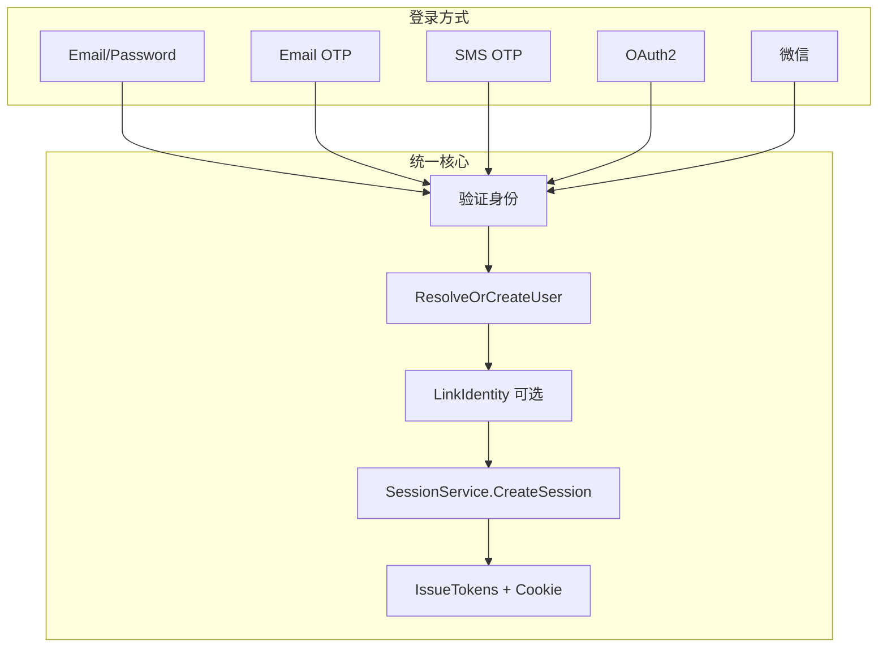

# Client 认证体系设计

> 最新更新：2026-06-30  
> 状态：Phase 5（Demo + Console Settings）已完成

---

## 1. 目标

为 Orionid Client API 提供统一、可扩展的多方式登录能力：

| 方式 | 阶段 | 状态 |
|------|------|------|
| Email + 密码 | P0 | ✅ 完成 |
| Email OTP | Phase 1 | ✅ 完成 |
| OAuth2 Google/GitHub | Phase 2 | ✅ 完成 |
| SMS OTP | Phase 3 | ✅ 完成 |
| 微信（Web / 公众号 / 小程序） | Phase 4 | ✅ 完成 |

所有登录方式最终收敛到同一条 **Session 流水线**，复用 JWT + session cookie 机制。

---

## 2. 架构概览



### 2.1 分层职责

| 层 | 路径 | 职责 |
|----|------|------|
| 传输层 | `internal/api/clientgrpc` | gRPC / HTTP gateway handler |
| 用例层 | `internal/app/client` | SignIn、OTP、OAuth 编排 |
| 领域端口 | `internal/domain/auth`、`internal/domain/messaging` | SessionService、OTPChallengeStore、Mailer |
| 适配器 | `internal/infra/auth`、`internal/infra/messaging` | Redis OTP、SMTP、OAuth provider |

### 2.2 Session 流水线（Phase 0 已落地）

```
HTTP 请求
  → ClientInfoInterceptor（提取 IP / User-Agent）
  → Account.finishSignIn()
  → SessionService.CreateSessionAndTokens(provider, ...)
  → 写入 sessions 集合 → 签发 access/refresh JWT
```

关键文件：

- `internal/domain/auth/session.go` — `SessionService` 端口
- `internal/infra/auth/session_service.go` — 实现
- `internal/app/client/user_roles.go` — JWT 角色解析
- `pkg/grpc/interceptor/client.go` — 客户端信息注入

---

## 3. 数据模型

### 3.1 系统集合

| 集合 | 用途 | 状态 |
|------|------|------|
| `users` | 用户主记录 | ✅ |
| `sessions` | 会话（含 provider、ip、user_agent） | ✅ |
| `identities` | 第三方身份绑定 | ✅ spec 已添加 |

#### identities 字段

| 字段 | 类型 | 说明 |
|------|------|------|
| `user_id` | string | 关联 users |
| `provider` | string | `google` / `github` / `wechat_web` 等 |
| `provider_uid` | string | 第三方唯一 ID |
| `provider_email` | string | 可选 |
| `provider_data` | json | 头像、昵称等 |
| `expire_at` | datetime | token 过期（如需 refresh） |

唯一索引：`(provider, provider_uid)`

### 3.2 OTP 状态（Redis）

OTP 挑战与限流数据存 Redis，利用 TTL 自动过期：

```
orionid:otp:ch:{challenge_id}     → 挑战 JSON（email、code_hash、attempts）
orionid:otp:send:{project}:{email} → 发码冷却（60s）
orionid:otp:ip:{project}:{ip}     → IP 计数（1h 窗口，上限 10）
```

OAuth state（Phase 2）：

```
orionid:oauth:state:{state}       → project_id、provider、redirect_uri、pkce_verifier
```

---

## 4. API 设计

### 4.1 已实现（P0 + Phase 0）

| 方法 | 路径 | 说明 |
|------|------|------|
| SignUp | `POST /v1/account/sign-up` | 邮箱注册 |
| SignIn | `POST /v1/account/sign-in` | 邮箱密码登录 |
| SignOut | `POST /v1/account/sign-out` | 登出 |
| RefreshToken | `POST /v1/account/refresh` | 刷新 token |
| Me | `GET /v1/account/me` | 当前用户 |
| ListSessions | `GET /v1/account/sessions` | 会话列表 |

### 4.2 Phase 1 — Email OTP

| 方法 | 路径 | 说明 |
|------|------|------|
| CreateEmailOTP | `POST /v1/account/sessions/email-otp` | 发送邮箱验证码 |
| CreateEmailOTPSession | `POST /v1/account/sessions/email-otp/verify` | 验证码登录 |

**CreateEmailOTP 请求：**

```json
{ "project_id": "...", "email": "user@example.com" }
```

**响应：**

```json
{ "challenge_id": "uuid", "expire_at": 1719750000 }
```

**CreateEmailOTPSession 请求：**

```json
{
  "project_id": "...",
  "email": "user@example.com",
  "challenge_id": "uuid",
  "otp": "123456"
}
```

**响应：** 与 SignIn 相同（account + tokens）

**用户解析规则：**

- 邮箱已存在 → 直接登录
- 邮箱不存在 → 自动注册（无密码，`email_verified=true`）

### 4.3 Phase 2 — OAuth2

| 方法 | 路径 | 说明 |
|------|------|------|
| CreateOAuth2Session | `GET /v1/account/sessions/oauth2/{provider}` | 返回授权 URL |
| OAuth2 Callback | `GET /v1/account/oauth2/{provider}/callback` | HTTP 302 回调（独立 handler） |
| CreateOAuth2TokenSession | `POST /v1/account/sessions/oauth2/{provider}/token` | 移动端 token 换 session |

优先实现：Google、GitHub

### 4.4 Phase 3 — SMS OTP

与 Email OTP 对称：

- `POST /v1/account/sessions/phone-otp`
- `POST /v1/account/sessions/phone-otp/verify`

### 4.5 Phase 4 — 微信

| 场景 | provider | 流程 |
|------|----------|------|
| 网站扫码 | `wechat_web` | 微信开放平台 QR Connect |
| 公众号 H5 | `wechat_mp` | OAuth2 网页授权 |
| 小程序 | `wechat_miniprogram` | code2session |
| 移动 App | `wechat_app` | 微信 SDK |

身份键优先使用 `unionid`，fallback 到各场景 `openid`。跨场景账号通过 `WeChatProviders()` 循环查找 identities 实现关联。

**API：**

| 场景 | 入口 |
|------|------|
| 网站扫码 / 公众号 H5 | 复用 OAuth2：`GET /v1/account/sessions/oauth2/{provider}` → callback |
| 小程序 | `POST /v1/account/sessions/wechat/miniprogram`（body: `project_id`, `code`） |

微信 OAuth **不使用 PKCE**（`wechat_web` / `wechat_mp`）。`session_key` 仅存在于微信 API 响应，不落库、不返回客户端。

---

## 5. 领域端口

```go
// internal/domain/auth/session.go
type SessionService interface {
    CreateSessionAndTokens(ctx, projectID, userID, email, provider string) (*TokenBundle, string, error)
    IssueTokens(ctx, projectID, userID, email, sessionID string) (*TokenBundle, string, error)
    EnsureActiveSession(ctx, projectID, sessionID, userID string) error
}

// internal/domain/auth/challenge.go
type OTPChallengeStore interface {
    CreateEmailChallenge(ctx, projectID, email, codeHash string) (challengeID string, expireAt time.Time, err error)
    VerifyEmailChallenge(ctx, projectID, challengeID, email, codeHash string) error
    CheckSendRateLimit(ctx, projectID, email, ip string) error
}

// internal/domain/messaging/mailer.go
type Mailer interface {
    Send(ctx context.Context, to, subject, body string) error
}
```

---

## 6. 安全策略

### 6.1 OTP

| 规则 | 值 |
|------|-----|
| 验证码长度 | 6 位数字 |
| 有效期 | 5 分钟 |
| 最大验证次数 | 5 次 / 挑战 |
| 同邮箱发码冷却 | 60 秒 |
| 同 IP 发码上限 | 10 次 / 小时 |
| 存储 | Redis 存 SHA-256 hash，不存明文 |

### 6.2 OAuth（Phase 2）

- 强制 `state` + PKCE（S256）
- callback 严格校验 `redirect_uri` 白名单
- 项目级 OAuth 配置加密存储 client_secret

### 6.3 账号合并

- OAuth email 与已有账号冲突时，要求已登录用户主动绑定 identity
- 不可静默覆盖已有账号的 provider 绑定

---

## 7. 配置

### 7.1 平台 SMTP（Phase 1）

```yaml
messaging:
  smtp:
    host: ""          # ORIONID_MESSAGING_SMTP_HOST
    port: 587
    username: ""
    password: ""      # ORIONID_MESSAGING_SMTP_PASSWORD
    from: "noreply@orionid.local"
    use_tls: true
  dev_log_otp: false  # 开发模式：SMTP 未配置时将 OTP 写入日志（禁止生产开启）
```

Phase 2 将支持项目级 SMTP（Console Settings）。

SMS（Phase 3）：

```yaml
messaging:
  dev_log_sms: false
  sms:
    provider: twilio
    twilio:
      account_sid: ""
      auth_token: ""
      from: "+1234567890"
```

---

## 8. 分阶段计划

| 阶段 | 内容 | 预估 | 验收标准 |
|------|------|------|----------|
| **Phase 0** | SessionService 抽取、identities 集合、IP/UA 记录 | 3-5 天 | ✅ 已完成 |
| **Phase 1** | Email OTP API + Redis + SMTP | 5-7 天 | ✅ 完成 |
| **Phase 2** | OAuth2 Google/GitHub + callback handler | 7-10 天 | ✅ 完成 |
| **Phase 3** | SMS OTP + Twilio/Dev | 5-7 天 | ✅ 完成 |
| **Phase 4** | 微信 Web + 小程序 | 10-14 天 | ✅ 扫码登录、code2session |
| **Phase 5** | SDK / Demo / Console Settings | 5-7 天 | ✅ 多 Tab 登录；OAuth 配置页 |

---

## 9. Phase 1 实现清单

- [x] `docs/auth-design.md` 设计文档
- [x] `proto/client/v1/account.proto` 扩展 Email OTP RPC
- [x] `internal/domain/auth/challenge.go` OTP 端口
- [x] `internal/infra/auth/otp_store_redis.go` Redis 实现
- [x] `internal/domain/messaging/mailer.go` + SMTP/Dev 适配器
- [x] `internal/app/client/email_otp.go` 用例
- [x] `internal/api/clientgrpc/account.go` handler
- [x] Wire 注入 + 配置 schema
- [x] 单元 / 集成测试

---

## 10. Phase 2 配置 OAuth Provider

执行迁移后，为项目插入 OAuth 凭据（Console 配置 UI 待 Phase 5）：

```sql
INSERT INTO project_oauth_providers (project_id, provider, client_id, client_secret, scopes)
VALUES (
  '<project_id>',
  'google',
  '<client_id>',
  '<client_secret>',
  ARRAY['openid','email','profile']
);
```

回调地址固定为：`{server.http.public_url}/v1/account/oauth2/{provider}/callback`

也可通过 Console **Settings → OAuth Providers** 或 Server API 管理：

- `GET /v1/server/oauth-providers`
- `PUT /v1/server/oauth-providers/{provider}`
- `DELETE /v1/server/oauth-providers/{provider}`

微信 provider 示例（`client_id` = AppID，`client_secret` = AppSecret）：

```sql
INSERT INTO project_oauth_providers (project_id, provider, client_id, client_secret, scopes)
VALUES
  ('<project_id>', 'wechat_web', '<appid>', '<secret>', ARRAY[]::text[]),
  ('<project_id>', 'wechat_mp', '<appid>', '<secret>', ARRAY[]::text[]),
  ('<project_id>', 'wechat_miniprogram', '<appid>', '<secret>', ARRAY[]::text[]);
```

## 11. 参考

- Appwrite Account 模块：`docs/appwrite-go-migration-modules.md` §3.5
- 技术决策（OAuth HTTP handler）：`docs/tech-decision.md`
- 路线图：`docs/roadmap.md` §2.1
